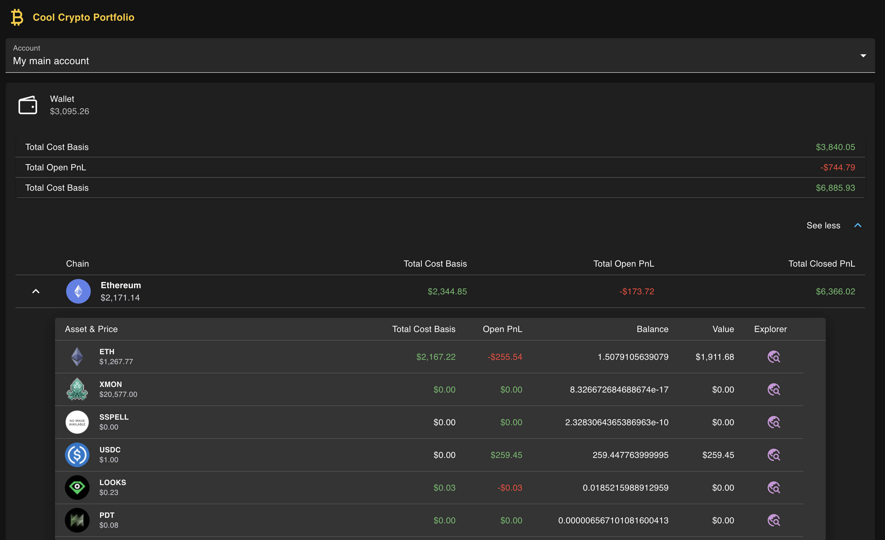

# Crypto Portfolio

Crypto portfolio management tool.

## Getting Started

#### Download source

Open a terminal and run the following commands:

```bash
$ git clone https://github.com/jscriptcoder/crypto-portfolio.git
$ cd crypto-portfolio
```

#### Installing and running development env

Install all the dependencies:

```bash
$ cd /path/to/crypto-portfolio
$ npm install
```

Next you're gonna open a second terminal to run the express server that interfaces with Defillama API. Under the hood it's just importing a JSON file with the data.

Run the following command:

```bash
$ npm run server
```

This server runs on http://localhost:4000/

Now run the development environment in the first terminal:

```bash
$ npm run dev
```

The application runs on http://localhost:3000/

Have fun 😊

#### Alternative with Docker

If you have Docker on your machine (tested on version 20.10.12), you can simply run the development environment in a container, so no need to install packages nor run the server and app separately.

```bash
$ npm run docker-dev
```

### Important note:

I'm simulating delay on each HTTP requests to make more obvious loading states.

## Sneak Peek


